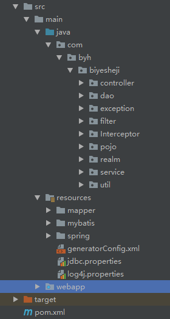
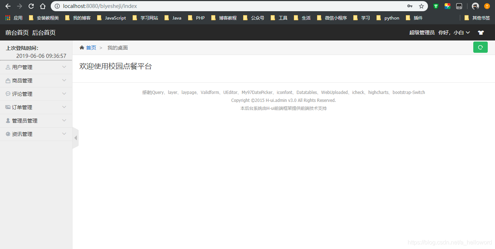
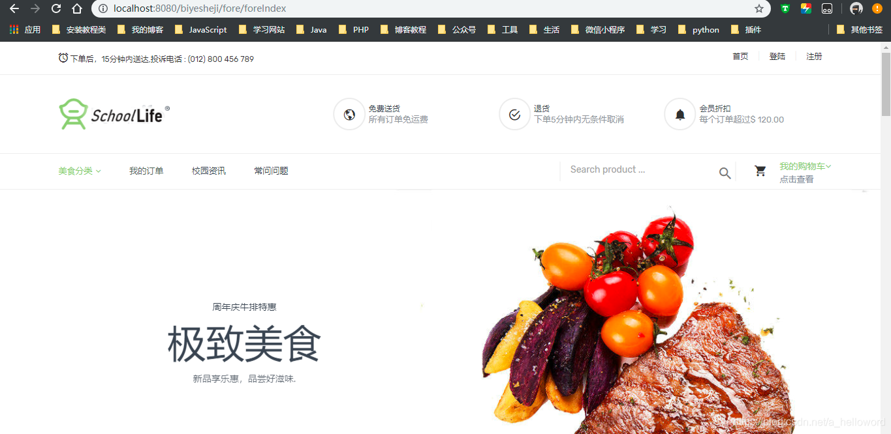

# order-meal-system
本项目适合对SSM框架有一定了解的同学。
**前端：jsp + BootStrap
后端：SSM
权限控制：Shiro
数据库：MySQL**

项目目录结构如下

IDEA选择Maven导入项目后，导入sql文件，修改项目的数据库配置，启动tomcat运行即可。

- 数据库脚本为biyesheji.sql;
- 后台超级管理员：name：小白，password：adminadmin
- 前台客户：name：byh，password：12345

下面是部分运行截图

**管理员后台**

**前端：**

#### 另外可以关注我的公众号【秃头哥编程】，佛系更新。

